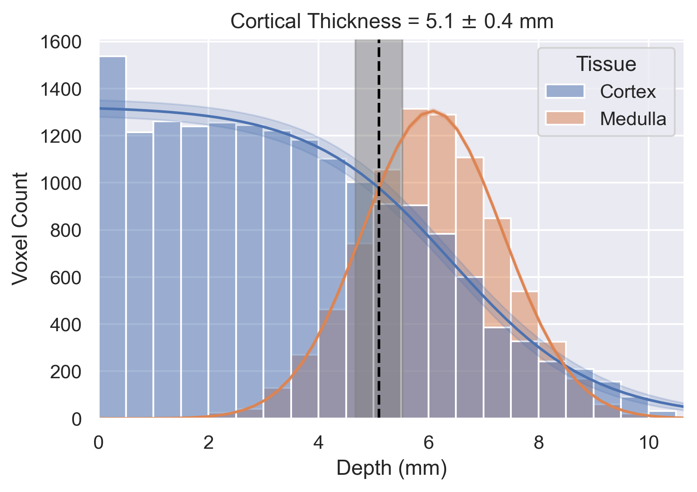

# Summary
Quantitative Magnetic Resonance Imaging (qMRI) provides informative measurements of structure and function of an organ where each volumetric pixel (voxel) provides a measure of the physical properties of the underlying tissue. Traditionally, analysis of MR images is performed by first segmenting the organ and its constituent tissue types, which for the kidneys involves separating them into the cortex and medulla, before calculating the average measurement within each voxel. The process of segmenting renal tissue types is typically manual, making it time consuming and prone to inaccuracies.

An alternative to voxel-based analysis in MRI is the layer model which divides the organ into ordered surfaces. For the kidney, this involves generating layers based on the distance of each voxel between the outer and inner surface of the kidney. From this, the gradient of change in qMRI measures between the cortex and medulla of the kidney can be computed to evaluate pathological and physiological aspects of the kidney. Here, `3DQLayers` an open-source Python software package to automatically define and interrogate 3D renal layers is presented.

# Statement of need
## Background
The kidneys are structurally and functionally complex organs in the abdomen responsible for the removal of waste products and excess fluid from the blood to produce urine [@lote_principles_2012]. Each kidney is separated into the cortex which forms the outer layer of the kidney and the medulla in the inner part which is arranged in a series of small pyramids [@hall_guyton_2015], as shown in \autoref{fig:renal_structure}. The kidney maintains homeostasis through filtration, reabsorption, secretion, and maintenance of the cortico-medullary gradient (CMG), meaning a method to assess changes in physiology from the cortex to the medulla is key.

Quantitative MRI (qMRI) goes beyond conventional MRI which primarily assesses signal intensity in a voxel in arbitrary units, by instead providing voxel-wise measurements with numerical significance in physical units, based on the tissues underlying properties. For example, qMRI of relaxation times with parameters which carry information about the local microstructure, or those of how readily water can diffuse through the tissue and the rate at which blood perfuses the tissue. To interpret quantitative images, regions of interest (ROIs) for the kidney cortex and medulla are defined in the tissue and statistical analysis performed on the voxels within each. Segmenting such ROIs manually is time consuming, and prone to intra- and inter-reader variation.

The group of Pruijm proposed an alternative to voxel based ROI analysis of tissue termed the Twelve Layer Concentric Object (TLCO) method [@piskunowicz_new_2015; @milani_reduction_2017; @li_renal_2020] where users delineate the inner and outer boundaries of the kidney to generate twelve equidistant layers between the renal pelvis and the surface of the kidney. The outer layers represent the cortex and the inner layers the medulla, with the gradient across the central layers computed to estimate the CMG. Since this layer-based analysis only requires segmentation of the boundaries of the kidney, rather than the cortex and medulla within, it is quicker and more repeatable. An analogy to this is the development of the layer-based analysis tools applied in the brain for neuroimaging including BrainVoyager [@goebel_brainvoyager_2012], CBSTools/Nighres [@bazin_computational_2014; @huntenburg_laminar_2017; @huntenburg_nighres_2018], FreeSurfer [@fischl_freesurfer_2012], and FSL [@jenkinson_fsl_2012].

However, the TLCO software is closed-source and has some limitations. It requires manual delineation of the outside and inside surfaces of the kidney, divides the kidney into the same number of layers irrespective of the size of the kidney, and can only be performed on a single slice cutting through the kidneys on their longest axis (coronal-oblique) which is not always desirable [@bane_consensus-based_2020]. Due to the spatial distribution of kidney pathology, there is a need to acquire multi-slice images for full 3D coverage of the kidney to increase the number of voxels sampled and gain a better understanding of the heterogeneity of the kidney. Recently, an automated-TLCO method has been proposed [@ishikawa_framework_2022]to determine the CMG from the water signal of a DIXON scan, however this work again has limitations of not being full kidney coverage, including the renal pelvis, and highlights the difficulty in analysing small kidneys with a fixed layer numbers.

The motivation of `3DQLayers` was to address these limitations of TLCO to provide an open-source Python package to automatically define 3D, multi-slice layers in the kidney of known thickness for quantitative-depth based analysis across a range of kidney MRI data, enabling its use in large renal MRI trials to address clinical questions.

## Methods
`3DQLayers` is an open-source Python package building on the ideas within TLCO, with the fundamental difference that the layers are defined based on a voxels’ distance from the surface of the kidney in millimetres rather than the proportion of the kidney. As such, the input to `3DQLayers` is a whole kidney mask, which can be automatically generated from a structural image (e.g. here using a U-net applied to T~2~-weighted images [@daniel_automated_2021; @daniel_renal_2024]).

The pipeline for defining the layers from the whole kidney mask is outlined in \autoref{fig:flowchart}. Pre-processing steps first fill in the holes in the kidney mask caused by cysts, as the surface of a cyst is not characteristic of the surface of the kidney. Next, the voxel-based representation of the ROI is converted to a smoothed mesh-based representation of the kidneys, the distance from the centre of each voxel to the surface of the mesh is then calculated to produce a depth map [@dawson-haggerty_trimesh_2023]. Tissue adjacent to the renal pelvis that is not representative of the medulla is then excluded from layer-based analysis. This is achieved by automatically segmenting the renal pelvis then calculating the distance from each voxel to the renal pelvis as described above. Those voxels closer than a specified threshold, typically 10 mm, are then excluded from the depth map. Finally, a layer image is generated by quantising the depth map to a desired layer thickness, typically 1 mm.

The layer image and quantitative images are resampled to the same spatial resolution using `NiBabel` [@brett_nipy/nibabel_2019], to allow each layer to be used as an ROI to interrogate each qMR image with statistical measures (e.g. median, standard deviation and kurtosis) across the depth of the kidney. The gradient of the central layers can be calculated to estimate the CMG in qMRI metrics. These metrics can be computed for the left and right kidney separately, or analysis in a combined manner. Additionally, if the renal cortex and medulla ROIs are available, the distribution of tissue types across layer depth can be explored. As the layers are generated from a structural image rather than the quantitative map, using `3DQLayers` stipulates no requirements on quantitative map acquisition, unlike TLCO.

An object-oriented interface is provided to allow end users to simply generate layers and apply these to quantitative MR images. [Documentation](https://qlayers.readthedocs.io/) is provided to guide users through installation via `PyPI`, `conda` or from [source code on GitHub](https://github.com/alexdaniel654/qlayers) and includes tutorials and an API reference. An automated test suite with high coverage provides users with confidence in the stability of `3DQLayers` and that there will be no unexpected changes to results unless highlighted in the change-log.

## Usage Examples
\autoref{fig:egfr_gradients} shows the use of `3DQLayers` to measure different gradients of R~2~^\*^ in a heathy volunteer with normal renal function and a patient with impaired renal function (an estimated glomerular filtration rate (eGFR) of above 90 ml/min/1.73m^2^ measured from blood samples is considered in the healthy range [@stevens_assessing_2006]). This replicates results shown using the TLCO, with a lower gradient in patients compared to healthies, however `3DQLayers` controls for kidney size resulting in the gradient being measured in quantitative units of Hz/mm rather than Hz/layer as in TLCO, thus increasing generalisability.

\autoref{fig:cortical_thickness} shows how `3DQLayers` can be used in combination with cortex and medulla tissue ROIs to analyse the distribution of voxel counts of each tissue as a function of layer depth of the kidney. Here cortex and medulla ROIs are initially generated using a Gaussian mixture model to segment a T~1~-weighted structural image followed by manual ROI correction. From this, average renal cortical thickness can be defined from the depth at which the voxel distribution crosses from cortex to medulla. Cortical thickness has been hypothesised as a potential biomarker of renal disease [@yamashita_value_2015]. 

`3DQLayers` can also be used to analyse ex-vivo kidneys imaged outside the body. \autoref{fig:exvivo_profiles} shows example quantitative maps acquired from a kidney removed for transplant but subsequently deemed unsuitable and the associated layer profiles. \autoref{fig:roi_layers_corr} compares the results of tissue ROI based analysis and layer-based analysis in fifteen transplant kidneys. A significant correlation between outer layers and the cortex, and inner layers and the medulla was shown across all quantitative mapping techniques and a significant correlation between cortico-medullary ratio and layer gradient was shown for T~1~, T~2~, T~2~ ^\*^ and Magnetisation Transfer Ratio (MTR) mapping.

# Figures
{ width=90% }

![The mask automatically computed using a U-net from the T~2~-weighted structural MR image (a i) has any cysts filled (a ii) and is converted into a smooth mesh representing the renal surface (b i and ii). The distance (in mm) of each voxel to the surface of the mesh is then calculated to generate a depth map (b iii). The renal pelvis is segmented (c i) and any tissue within 10 mm (c ii) of the pelvis is excluded from the depth map (c iii). The tissue is then grouped into layers of a desired thickness, here shown as 5 mm renal layers for illustrative purposes (d). \label{fig:flowchart}](flowchart.png)

{ width=50% }

![ Agreement between tissue ROI-based measures and analogous layer-based measures shown for fifteen ex-vivo transplant kidneys for each qMRI alongside the Pearsons correlation coefficient ($\rho$). * represents a _p_-value between 0.05 and 0.1, ** between 0.01 and 0.001, and *** < 0.001. a) Plots the median within each tissue ROI (cortex or medulla semi-automatically defined) against the equivalent layers (outer layers and inner layers respectively as highlighted in \autoref{fig:exvivo_profiles}) b) Shows the cortico-medullary ratio (calculated by dividing the median within the cortex ROI by the median within the medullary ROI) against central layer gradient profiles calculated using `3DQLayers`. \label{fig:roi_layers_corr}](roi_layers_corr.png)

# Acknowledgements
We acknowledge the funding support of the ADMIRE project funded through Kidney Research UK (KS_RP_002_20210111), and the UKRIN_MAPS project funded by the Medical Research Council (MR/R02264X/1), as well as the NIHR Nottingham Biomedical Research Centre during the genesis of this project.

# References