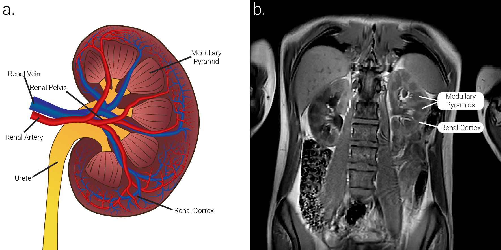

# Summary
### Why renal MRI?
The kidneys are a pair of structurally and functionally complex organs in the lower abdomen that participate in the control of bodily fluids by regulating the balance of electrolytes, excreting waste products of metabolism and excess water from blood to urine [@lote_principles_2012]. The each kidney is separated into two tissue types; cortical tissue located towards the outside of each organ, and medullary tissue arranged in small pyramids towards the centre of the organ [@hall_guyton_2015], \autoref{fig:renal_structure}. Magnetic Resonance Imaging (MRI) is the ideal medical imaging modality to study the kidneys do to its non-ionising, non-invasive and quantitative nature [@francis_magnetic_2023; @selby_assessment_2024]. 
### Why layers?
### Why 3DQLayers?
 
# Statement of need
TLCO [@piskunowicz_new_2015; @milani_reduction_2017; @li_renal_2020]
# Figures

# Acknowledgements

# References